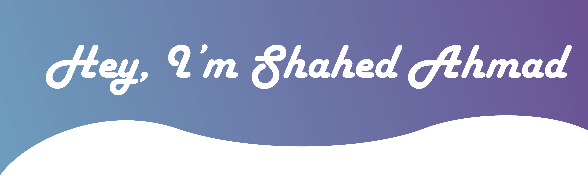

<!-- ### Hi there 👋 -->

   <h3>
       Shahed Ahmad Ahadi | 🧐 Self Taught 💻 Full Stack Developer |  AFG 
   </h3>

<!--
**ShahedAhmadAhadi/ShahedAhmadAhadi** is a ✨ _special_ ✨ repository because its `README.md` (this file) appears on your GitHub profile.

Here are some ideas to get you started:-->

 - 🔭 I’m currently working on Django, react

- <!--  🌱 I’m currently learning django & React -->
-   ✨ and learning next.js & rest_api
<!-- - 👯 I’m looking to collaborate on ...
-   🤔 I’m looking for help with ...
-   💬 Ask me about ...
-   📫 How to reach me: ...
-   😄 Pronouns: ...
-   ⚡ Fun fact: ... -->
## Languages & frameworks ->

  <!-- For more icons please follow  https://github.com/MikeCodesDotNET/ColoredBadges -->
  
  
  
  
  
  

   
   

<table>
   
   <table width="100%">
   <tr>
      <td>
         
      </td>
      <td>
               
      </td>
   
   </tr>
<!-- https://github-readme-stats.vercel.app/api/top-langs/?username=ShahedAhmadAhadi&show_icons=true&hide_border=true&layout=compact&langs_count=8&bg_color=0,52fa5a21,4dfcff21,c64dff21&theme=tokyonight -->
<table>

<!--  -->

